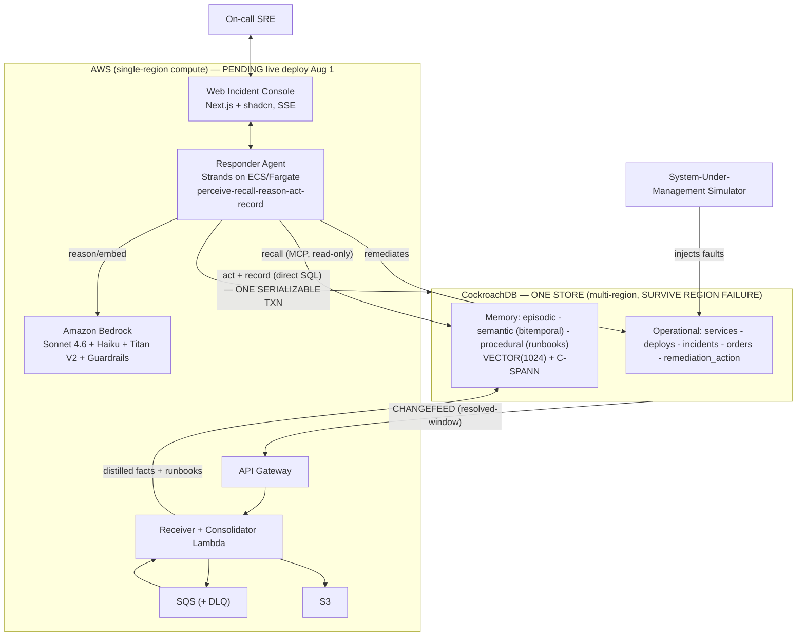

# Postmortem

**Postmortem is an on-call SRE agent whose memory is load-bearing.** When an incident recurs, it
recalls the fix that actually worked last time, acts on the live system to remediate, and records the
action and its outcome **in the same transaction** — because its memory (embeddings + facts) and the
operational data it acts on live in **one CockroachDB store**. The two can never disagree, the memory
survives a full region outage with zero data loss, and a background job consolidates raw incidents
into reusable runbooks overnight. Most on-call AI agents start every incident cold; this one doesn't.

## Why this exists (the problem)

On-call AI agents start **cold** every incident. Institutional knowledge — past incidents, what
actually fixed them, service topology — is scattered and lost, so orgs re-solve the same outages and
MTTR stays high. Postmortem makes memory the thing that drives faster resolution. It wins on the three
axes CockroachDB uniquely owns (the "wedge"):

1. **Single store** — memory and the operational action commit in **one ACID transaction**.
2. **Read-your-own-writes at global scale** — a memory just written is recalled instantly by any agent
   in any region.
3. **RPO=0 region survival** — kill a region live; memory + agent keep working, zero data loss.

We deliberately do **not** compete on raw ANN speed or memory-only convenience — the agent **acts on
real operational data**, which is exactly what a memory-only store can't do.

## Status at a glance (accuracy over hype)

| Capability | State |
|---|---|
| Perceive → recall → reason → act → record loop | **Locally proven** (Phase 1, verifier green) |
| Single-store one-transaction `remediate_and_record` | **Locally proven** (live serializable proof) |
| Retrieval quality (real, with hard negatives) | **Measured** — recall@1 = 0.85, recall@10 = 1.0, nDCG@10 = 0.94 `[real-run: python -m postmortem_eval]` |
| Agent decision quality (MTTR / wrong-actions) | **Pending real-agent run** — needs the real Bedrock agent. A competent memoryless baseline ties on the deterministic simulator, so **no "% faster" is claimed until the real agent runs** (Reality Charter R7) |
| Multi-region RPO / RTO under a *real* region kill | **Measured** on a 9-node cluster with leaseholders pinned to the killed region — **RPO = 0** (content-verified during the outage), **RTO 3.5–4.9s** `[real-run: verify_phase3.sh]` |
| Bitemporal facts + temporal drift; audit/PITR/hardening | **Locally proven** (Phase 3 B/C) — integrated; `verify_phase3.sh` passes Tracks A + B + C |
| Live Bedrock, ECS/Fargate, Lambda consolidation on real AWS, public demo URL | **Pending real AWS deployment (Aug 1)** — see notes below |

> **What "pending AWS" means.** The AWS boundary (Bedrock reasoning/embeddings, ECS/Fargate hosting,
> the changefeed→SQS→Lambda consolidation pipeline, S3) is designed and locally exercised through a
> `fake` runtime and local tests, but is **not yet deployed to a live AWS account**. Every claim above
> marked "locally proven" runs today with `docker compose` and the verify scripts; nothing here claims
> live AWS is done.

## Architecture

Full diagram and data-flow narrative: [`docs/ARCHITECTURE.md`](docs/ARCHITECTURE.md).



## CockroachDB tools used & HOW

The hackathon requires ≥2 CockroachDB tools with a writeup of what the agent actually does with each.
Postmortem uses **all four**:

- **C-SPANN vector index** — memory recall. Embeddings are stored as `VECTOR(1024)` (Titan V2,
  unit-normalized) alongside the facts and operational data in the *same* database. A prefix-scoped
  C-SPANN index `(agent_id[, org_id], embedding)` accelerates approximate nearest-neighbor recall of
  prior incidents. When an incident arrives the agent embeds it and asks C-SPANN for the top-k most
  similar prior cases and their proven runbooks — this is the "the agent remembered" beat. The index
  inherits the cluster's REGION-survival replication, so recall keeps working through a region kill.
- **Managed MCP (read path)** — the agent's read-only "hands" on memory. Recall runs through
  CockroachDB's Managed MCP server under a **read-only service account** (RBAC-scoped, audited,
  system-table deny-listed). Splitting recall (MCP, read-only) from the act+record write (direct SQL,
  writer account) makes the recall-vs-act boundary a real RBAC boundary, not a convention. MCP's
  `insert_rows` is single-table/stateless and deliberately **cannot** hold the atomic
  memory+action transaction — so the wedge write does not go through MCP.
- **ccloud CLI** — the failover money shot and control-plane ops. The demo drives a **region
  disruption** (`ccloud cluster disruption`, plus backup/maintenance-window verbs) to kill a database
  region live while the agent keeps recalling and acting against the surviving quorum. `ccloud`'s
  noun-verb structure and `-o json` output make it machine-drivable from the demo harness.
- **Agent Skills** — production hardening. CockroachDB's open Agent Skills (security/governance,
  operations) drove Track C hardening: audit logging, least-privilege roles, PITR/backup, and CIS
  benchmark checks. Findings and the concrete skill-guidance bugs we hit (v26.2 `schema_locked` vs.
  `EXPERIMENTAL_AUDIT`; `sql.log.user_audit` accepting only ALL/NONE; `kv.rangefeed.enabled=false` on
  a fresh node) are documented in [`docs/HARDENING.md`](docs/HARDENING.md).

## AWS services used & HOW

The hackathon requires ≥1 AWS service with a writeup. Postmortem's design uses Bedrock + Lambda + S3 +
ECS/Fargate (plus API Gateway, SQS, Secrets Manager, CloudWatch). **Live deployment is pending Aug 1**;
the roles below describe what each service does in the system.

- **Amazon Bedrock (reasoning + embeddings)** — Claude **Sonnet 4.6** for the core perceive→reason→act
  decision and consolidation distillation; **Claude 3.5 Haiku** for cheap high-volume paths (triage,
  dedup); **Titan Text Embeddings V2** (`amazon.titan-embed-text-v2:0`, `normalize=true`, 1024 dims)
  for the embeddings stored in C-SPANN. **Bedrock Guardrails** screen injected alert content and
  consolidation output. Locally, a `fake` runtime stands in for Bedrock so the full event sequence runs
  without AWS credentials; the production runtime swaps in real Bedrock.
- **AWS Lambda (consolidation)** — the sleep-time job, never the interactive agent. A fast-ack
  **receiver** Lambda validates and enqueues changefeed webhooks; a **consolidator** Lambda reads a
  closed `resolved`-window (follower reads), distills raw episodes into semantic facts + procedural
  runbooks with Bedrock, and writes them back idempotently (bitemporal transitions for facts, versioned
  upserts for runbooks). The consolidation logic is implemented and tested locally (`consolidation/`).
- **Amazon S3** — raw postmortems/transcripts and the seed-corpus fixture, plus per-distillation
  provenance (exact Bedrock prompt+response). CockroachDB rows store only the S3 reference + embedding +
  metadata, keeping large blobs out of the row.
- **ECS/Fargate (hosting)** — one always-on service hosting the FastAPI backend + Strands agent loop
  with a warm CockroachDB connection pool and SSE streaming to the console. Chosen over Lambda for the
  interactive agent (Lambda's 15-min cap + connection churn make it wrong for a streaming, always-on
  responder; right for async consolidation). AgentCore Runtime is the documented production upgrade.

Full AWS design: [`research/postmortem/03-aws-infrastructure.md`](research/postmortem/03-aws-infrastructure.md).

## Repository layout

| Path | Purpose |
|---|---|
| `backend/` | Python responder, tool adapters (MCP recall + direct-SQL writer), HTTP/SSE API, atomic `remediate_and_record` path |
| `db/` | CockroachDB migrations, bootstrap (C-SPANN enable, multi-region), tests |
| `simulator/` | Deterministic system-under-management (SUM) conductor + incident/drift fixtures |
| `evaluation/` | With-memory vs. cold-start A/B harness, recall@k, MTTR, business-impact metrics |
| `resilience/` | RPO/RTO/freshness/cross-agent/atomicity probes + live region-kill harness |
| `consolidation/` | Sleep-time changefeed consolidation logic (Lambda handler + distillation) |
| `web/` | Next.js incident console (`postmortem-console`) |
| `infra/` | AWS CDK (Python) application |
| `research/` | Charter, master plan, and the six specialized design docs |
| `docs/` | Architecture, demo script, submission checklist, hardening, session/phase notes |

## Setup & run (locally proven today)

Prerequisites: Docker, Python 3.12+, Node.js 22+ and pnpm 10+.

```bash
cp .env.example .env

# Bring up the Phase 1/2 single-node CockroachDB and apply migrations
docker compose up -d cockroach
docker compose run --rm db-migrate
```

Verify each phase (each verifier brings up the infrastructure it owns and runs that phase's suites):

```bash
# Phase 1 — the vertical slice: alert -> recall -> reason -> remediate_and_record (one txn) -> events
./scripts/verify_phase1.sh

# Phase 2 — memory becomes load-bearing: full recall, consolidation logic, A/B MTTR harness,
#           backend + integration + db + simulator + evaluation + consolidation + infra + web suites
./scripts/verify_phase2.sh

# Phase 3 — resilience: brings up the 9-node simulated multi-region cluster, applies
#           SURVIVE REGION FAILURE, runs a real region-kill-and-recover cycle, and (re)produces
#           evaluation/reports/phase3-resilience.json
./scripts/verify_phase3.sh
```

Notes:
- The backend's default **`fake` runtime** contains the single prior successful rollback memory the
  Phase 1 milestone needs, so `perceive → recall → reason → act → record` runs **without AWS
  credentials**. The production runtime swaps the doubles for Bedrock/Strands, Managed MCP recall, and
  direct CockroachDB SQL.
- `scripts/verify_phase3.sh` runs the full Phase 3 exit gate end to end: **Track A** (bring up the
  9-node cluster + live region-kill + RPO/RTO/freshness/atomicity/cross-agent telemetry), **Track B**
  (bitemporal transitions, temporal drift, temporal-validity — against the live multi-region primary),
  and **Track C** (audit logging + least-privilege grants + PITR/backup smoke test). Track C's checks
  also run standalone: `scripts/audit_check.sh`, `scripts/backup_pitr_smoke.sh`. Failover demo:
  `scripts/failover_demo.sh` (set `RESILIENCE_TEARDOWN=1` to auto-teardown). The remaining Phase 3
  item is **Track D** — the console UI surfaces for the resilience/temporal telemetry.

## Demo

A `<3-minute` screen-recorded walkthrough hits, in order: **memory changes the action** (Recall Thread
to a 0.94-similar prior case) → **memory + action in one transaction** (the Transaction Envelope) →
**live region kill with RPO=0** (the money shot) → **overnight consolidation** (raw cases distilled into
the runbook the agent just used). The shot-by-shot recording script (ready to record Aug 1, with a
camera-safe deterministic-replay fallback) is in [`docs/DEMO_SCRIPT.md`](docs/DEMO_SCRIPT.md); the UX
rationale is in [`research/postmortem/06-demo-and-ux.md`](research/postmortem/06-demo-and-ux.md).

## Submission

Devpost deliverable status and the judging-criteria coverage map:
[`docs/SUBMISSION_CHECKLIST.md`](docs/SUBMISSION_CHECKLIST.md).

## License

MIT. See [`LICENSE`](LICENSE).
