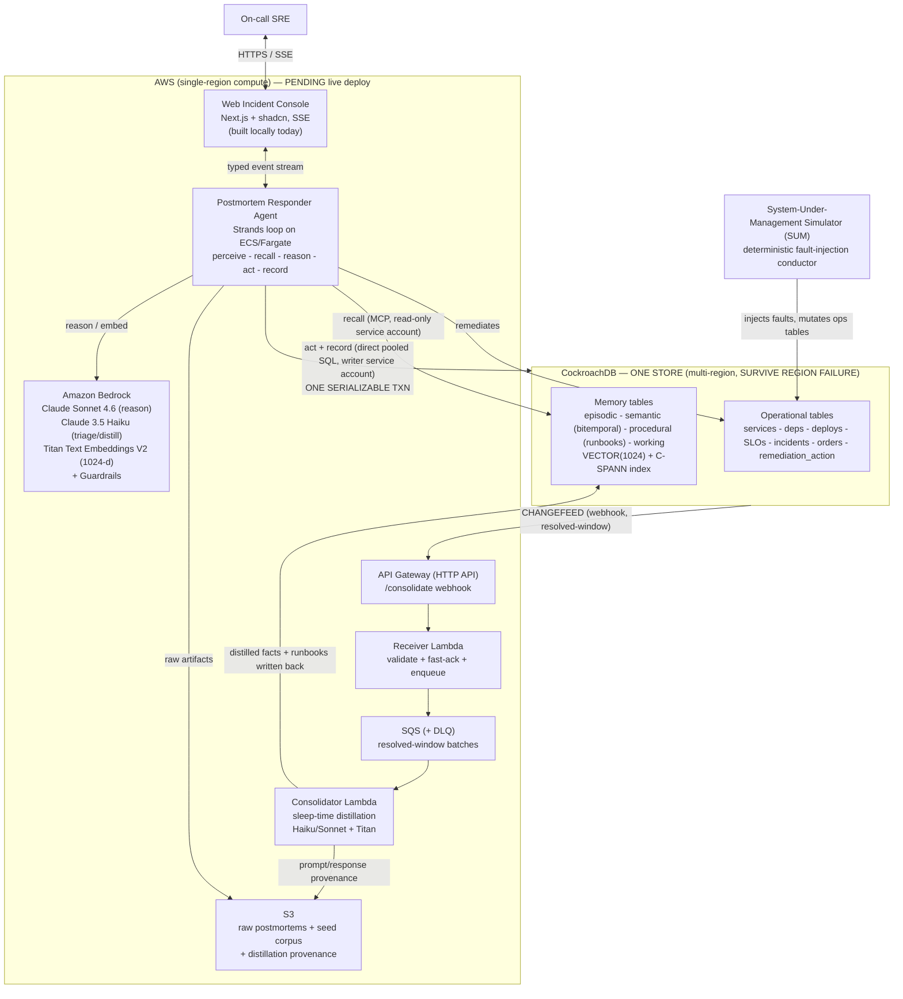

# Postmortem — Architecture

Postmortem is an on-call SRE agent with persistent, self-improving memory. Its memory (embeddings +
facts) and the operational data it acts on live in **one CockroachDB store**, so a memory write and a
remediation write commit in a single serializable transaction and can never disagree.

This document is the unified system view reconciled in
[`research/postmortem/07-master-plan.md`](../research/postmortem/07-master-plan.md) §3. It shows the
agent loop, the single store, the changefeed → SQS → Lambda consolidation path, Bedrock, the web
console, and the system-under-management simulator, followed by a data-flow narrative and the three
wedge proofs.

> **Status honesty.** The diagram is the *target* deployment. What is **proven locally today** vs.
> **pending real AWS deployment** is marked throughout and summarized at the bottom. The
> managed-AWS boxes (Bedrock, Lambda, SQS, API Gateway, S3, ECS/Fargate) are designed and, where
> local analogues exist, exercised locally — but they are **not yet deployed to a live AWS account**.

## System diagram

## Data-flow narrative

1. **Perceive.** The SUM conductor injects a deterministic fault (e.g. p99 latency spike on
   `checkout-api` after a canary deploy) and mutates the operational tables. The alert reaches the
   responder agent, which surfaces it in the console's Investigation rail.
2. **Recall.** The agent embeds the incident (Titan V2, 1024-d, unit-normalized) and runs a vector +
   relational recall over the memory tables through CockroachDB's **Managed MCP read path** (a
   read-only service account). C-SPANN returns the top-k prior incidents with similarity scores; the
   procedural runbook that actually fixed the closest prior case is pulled in. The console draws the
   **Recall Thread** from the current case to the recalled prior case.
3. **Reason.** Bedrock (Claude Sonnet 4.6, Guardrails on) proposes an action grounded in the recalled
   memory — the recalled fix *changes what the agent does* (roll back the canary rather than naively
   scale up).
4. **Act + Record (the wedge).** The operational mutation (`rollback_deploy`) and the episodic memory
   write commit in **one serializable transaction** through a **direct pooled SQL writer service
   account** — not MCP, because MCP `insert_rows` is single-table/stateless and cannot hold the
   multi-statement atomic transaction. Because memory and operational data are co-located, the two
   writes share one `BEGIN…COMMIT` and can never diverge.
5. **Read-your-writes.** The just-written memory is immediately recallable by any agent identity on any
   node/region via leaseholder reads on the hot path — no replication lag on the recall→act path.
6. **Consolidate (sleep-time).** A CockroachDB **changefeed** (webhook sink, `resolved`-window
   watermarks) streams episodic/semantic/procedural changes to API Gateway → a fast-ack receiver
   Lambda → SQS → the consolidator Lambda. The consolidator reads a closed window (follower reads),
   distills raw episodes into semantic facts + procedural runbooks with Bedrock (Haiku pre-filter,
   Sonnet distill), and writes them back **idempotently** — semantic facts as **bitemporal
   transitions** (close current, open new), runbooks as versioned upserts. Provenance (exact
   prompt/response) is archived to S3.
7. **Resilience underneath all of it.** The store spans three regions with `SURVIVE REGION FAILURE`.
   Killing a database region does not lose data (RPO=0) and recovers automatically; the agent keeps
   recalling and acting against the surviving quorum. Compute lives in one region on purpose — RPO=0 is
   CockroachDB's property, not the compute tier's.
   The compute tier reaches CockroachDB two ways, chosen at synth time: **PrivateLink** (default — no
   NAT, isolated subnets, DB traffic never touches the internet) or an opt-in **public** egress mode
   with NAT for CockroachDB Cloud tiers where PrivateLink is not offered. The CDK refuses to
   synthesize a PrivateLink deployment without a real endpoint-service name rather than deploying a
   VPC with no path to the database.

## The three wedge proofs

These are the axes CockroachDB uniquely owns; the build exists to demonstrate them (charter §4).

1. **Single store — memory and action are one ACID transaction.** The `remediate_and_record` path
   writes the operational mutation and the episodic memory in one serializable `BEGIN…COMMIT`, in one
   database. Rendered in the console as a single **Transaction Envelope** bracketing two differently
   colored rows under one commit hash. *Locally proven today* (Phase 1/2, live serializable
   `remediate_and_record` proof green).
2. **Read-your-own-writes at global scale.** A memory just written is immediately recalled by any
   agent/node/region with no lag. *Locally proven today* (Phase 3 Track A freshness/cross-agent
   probes: read-your-write 7–190ms `found_immediately=true`; cross-agent visibility 13–44ms
   cross-region).
3. **RPO=0 region survival.** Kill a database region live; memory + agent keep working, zero rows
   lost, automatic recovery. *Locally proven today* on the 9-node simulated multi-region cluster
   (Phase 3 Track A, real failover: RPO=0 content-verified during the outage; RTO **3.1–4.9s** with
   leaseholders pinned into the killed region so a genuine lease handoff occurs).
   The managed/self-hosted **AWS rehearsal and camera capture are pending** — the local proof
   establishes feasibility, not the final recording.

## What is proven locally today vs. pending AWS

| Element | Status |
|---|---|
| Perceive → recall → reason → act → record loop (fake runtime) | Locally proven (Phase 1, green) |
| Single-store one-transaction `remediate_and_record` | Locally proven (Phase 1/2, live serializable proof) |
| Retrieval quality (real) | Measured (Phase 2 v2: recall@1=0.85 with hard negatives, nDCG@10=0.94) |
| Agent MTTR delta | Pending real-agent run (no rigged number; Reality Charter R7) |
| Multi-region RPO=0 / RTO<10s | Locally proven on 9-node simulated cluster (Phase 3 Track A) |
| Bitemporal fact transitions + temporal-drift | Implemented + individually verified (Phase 3 Track B); integrated into `verify_phase3.sh` |
| Audit logging, PITR/backup, least-privilege roles | Implemented + individually verified (Phase 3 Track C); integrated into `verify_phase3.sh` |
| Bedrock (Sonnet/Haiku/Titan), Guardrails | Designed; boundary stubbed by `fake` runtime locally; **live Bedrock pending** |
| Changefeed → API GW → SQS → Lambda consolidation | Consolidation logic implemented + tested locally; **live AWS wiring pending** |
| ECS/Fargate hosting, S3, public demo URL | **Pending** |
